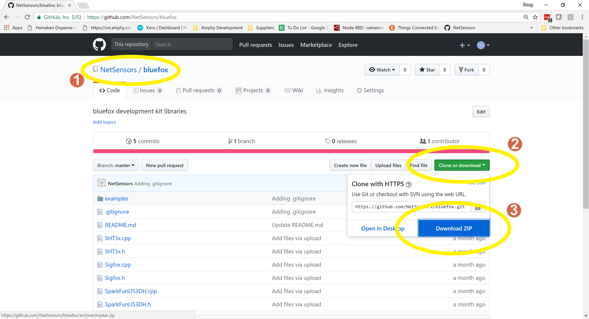
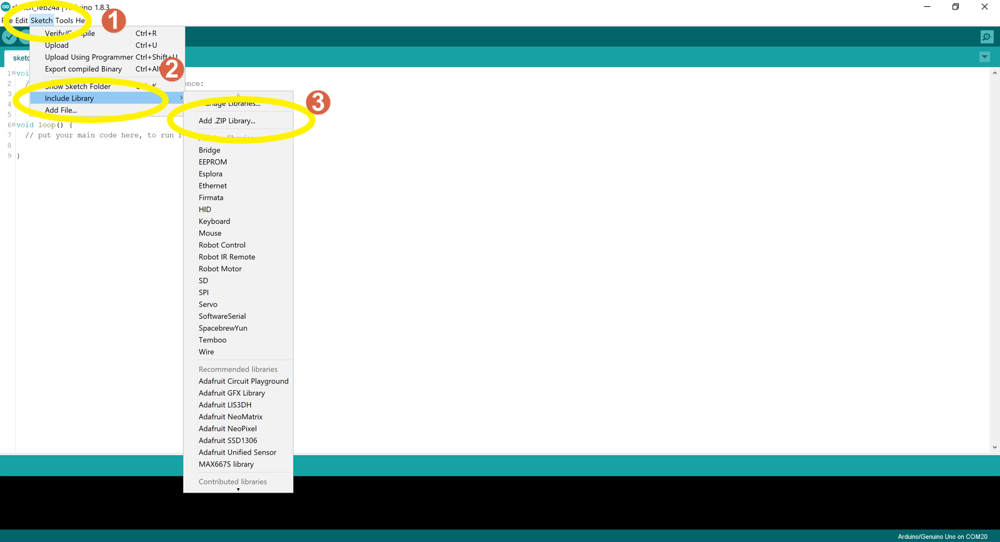
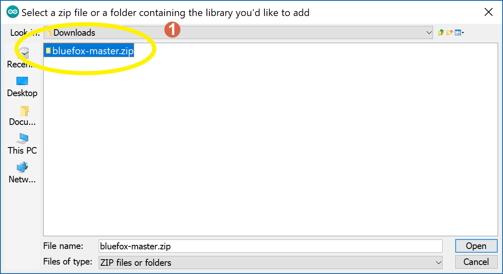
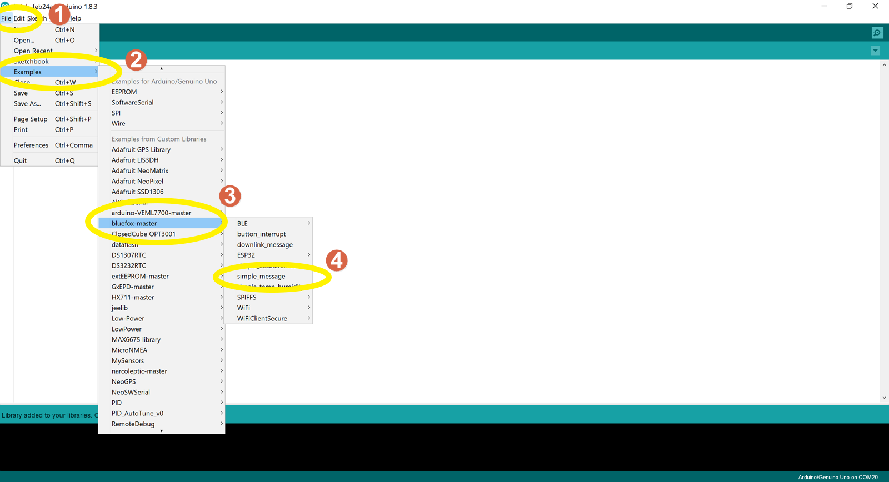
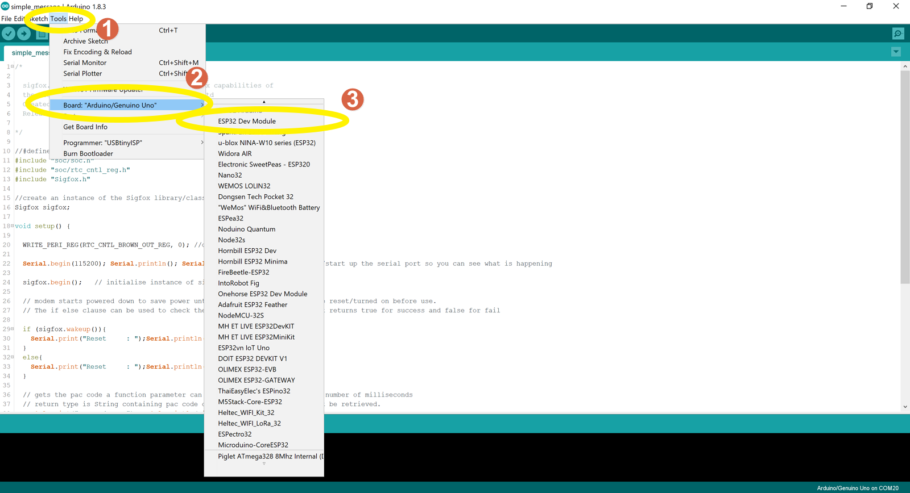
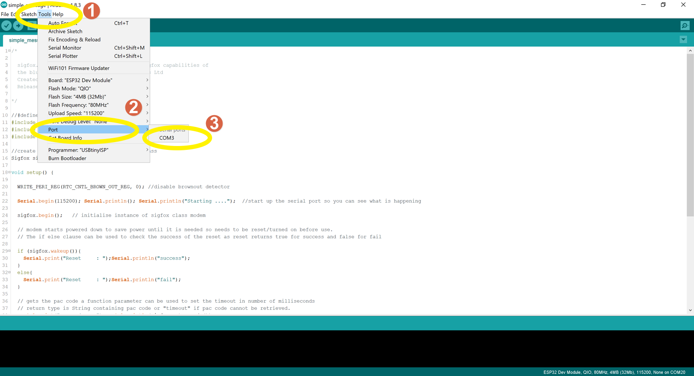
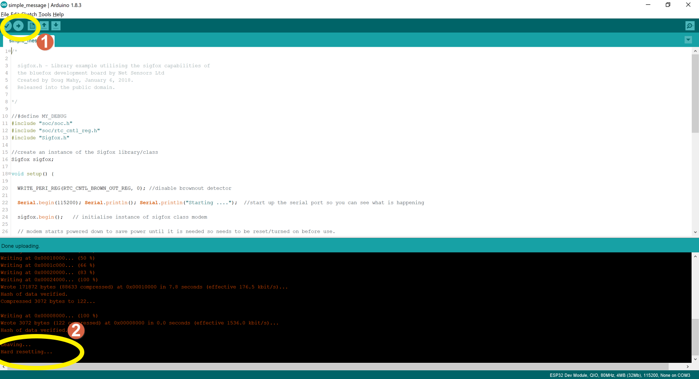
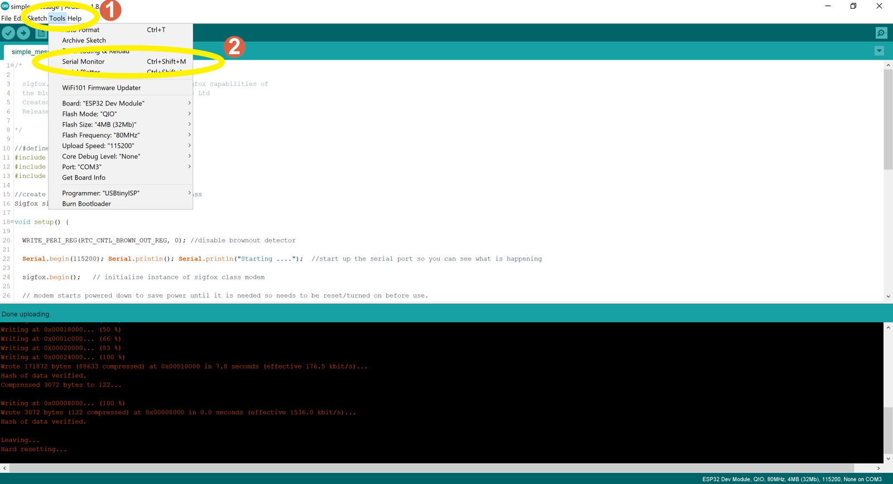
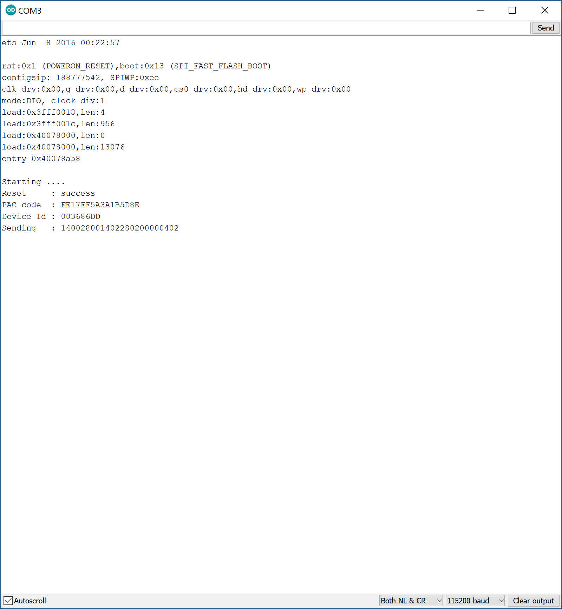

# bluefox

- Install Arduino ESP32 support on Windows, instructions here https://github.com/espressif/arduino-esp32/blob/master/docs/arduino-ide/windows.md

- Next we Install the bluefox libraries setup the development enviornment and load our first sketch.

